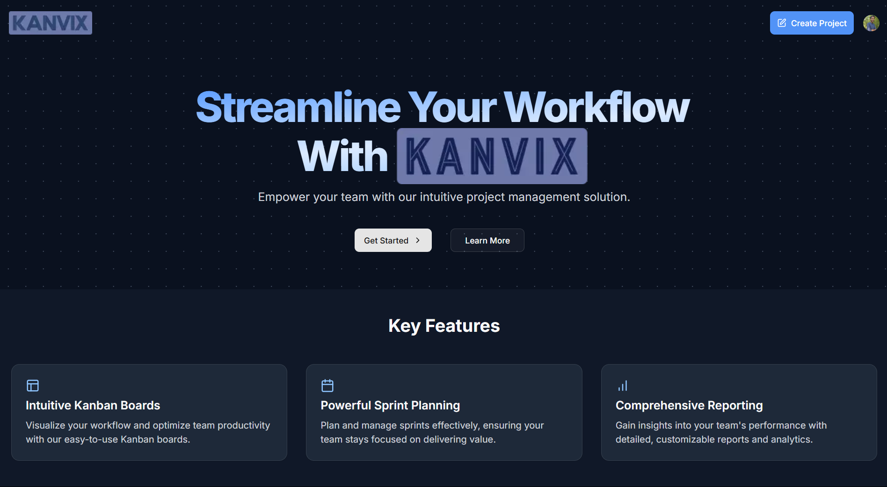
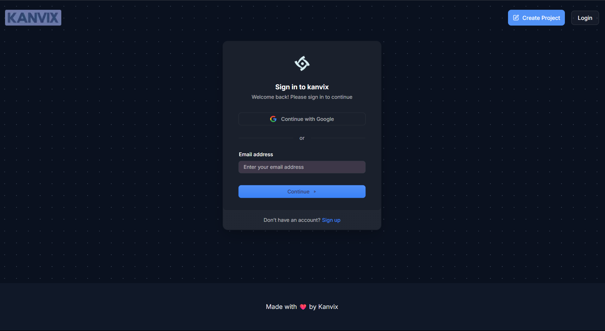
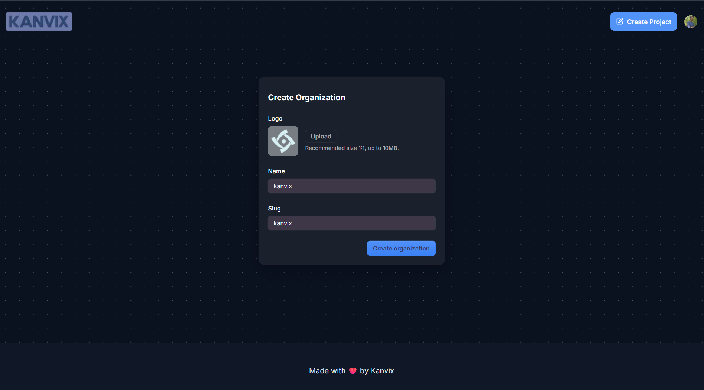
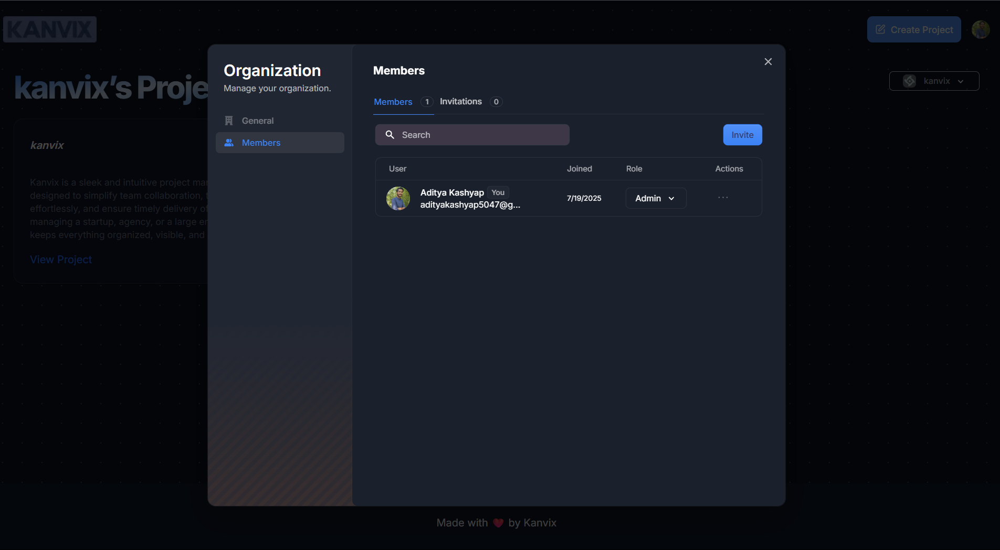
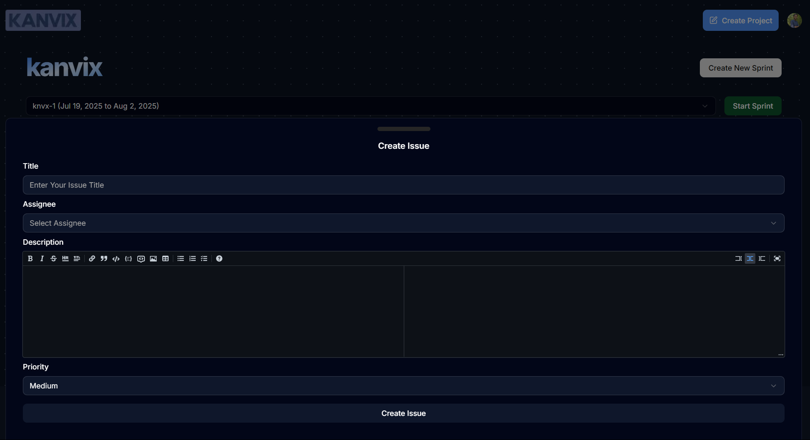
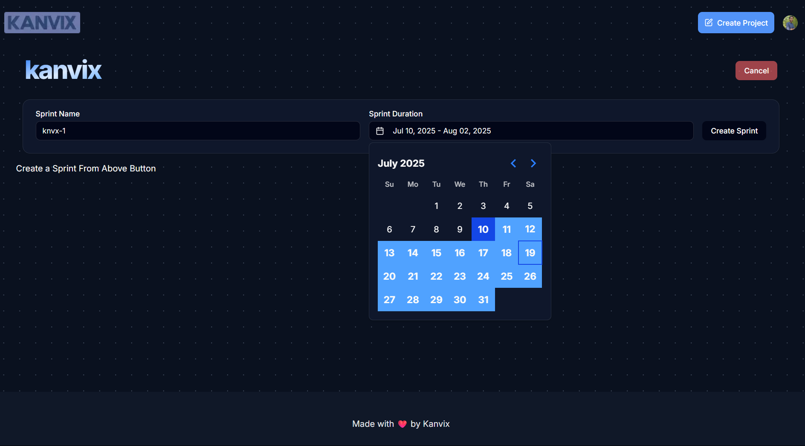
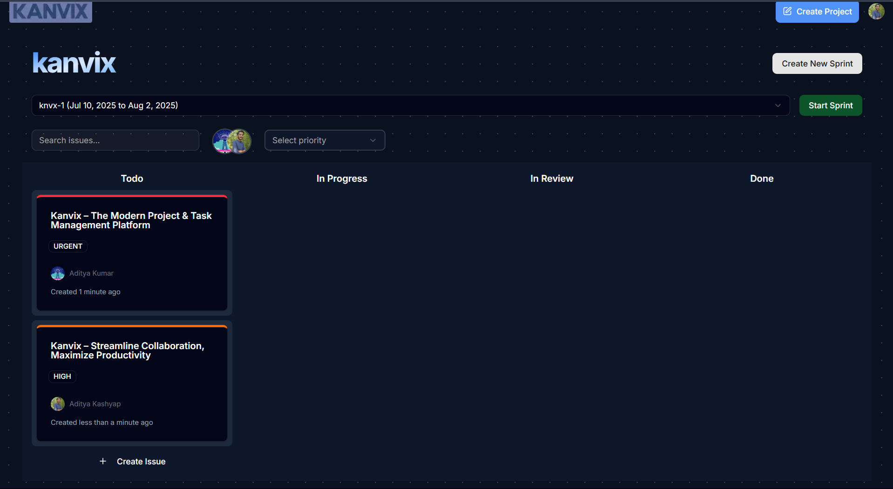
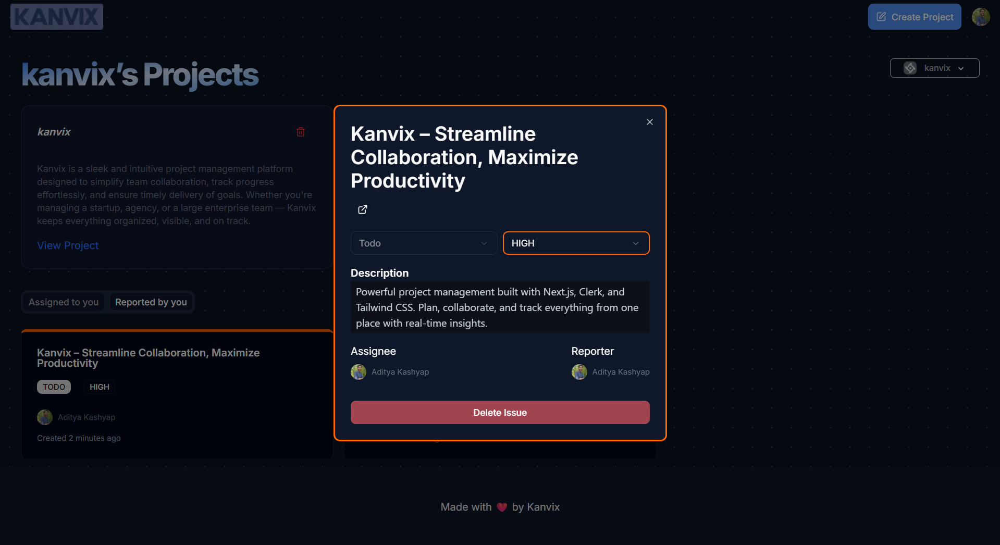

#  **Kanvix**

> **A modern project management platform to streamline collaboration and boost productivity.**

---

## Overview

**Kanvix** is a sleek and intuitive project management platform designed to simplify team collaboration, track progress effortlessly, and ensure timely delivery of goals. Whether you're managing a startup, agency, or a large enterprise team — Kanvix keeps everything organized, visible, and on track.

---

## Key Features

- Task and project tracking with real-time updates
- Team collaboration and role-based access
- Calendar & milestone planning
- Dashboard with progress analytics
- Secure authentication and data handling

---

## Screenshots

<div align="center">
  
  
  
  
  
  
  
  
</div>

---

## Tech Stack

- **Frontend**: React / Next.js / Tailwind CSS 
- **Backend**: Next.js API Routes / Prisma ORM  
- **Database**: PostgreSQL 
- **Authentication**: Clerk  
- **Form Handling & Validation**: React Hook Form / Zod  
- **UI Components**: Shadcn / Radix UI / Lucide Icons  

---

## Running Locally

```bash
# Clone the repository
git clone https://github.com/adityakashyap5047/kanvix.git

# Navigate to the project directory
cd kanvix

# Install dependencies
npm install

# Rename the .env.example file to .env
mv .env.example .env

# Fill in the required environment variables in the .env file

# Start the development server
npm run dev

```
---

## 🌐 Live Demo
[](https://kanvix.vercel.app)

## Contributing  
Contributions are welcome!  
Please open an issue first to discuss what you would like to change.

---

## License  
This project is licensed under the **MIT License**.

---

## Acknowledgements  
Inspired by tools like **Trello**, **Asana**, and **Notion**.  

Thanks to all contributors and the open-source community 
